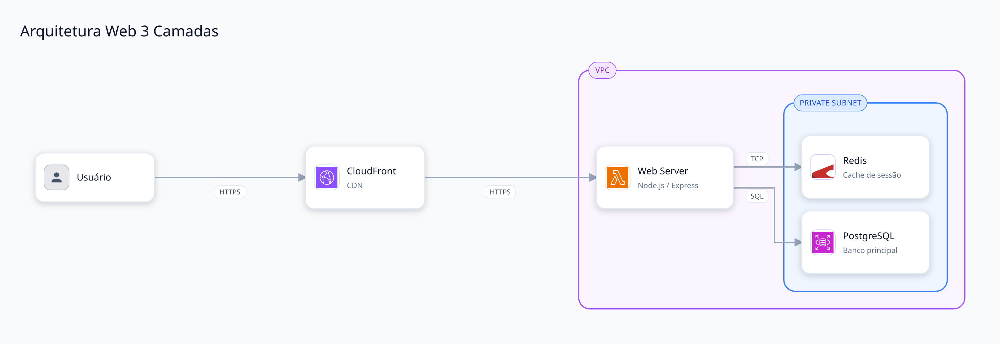
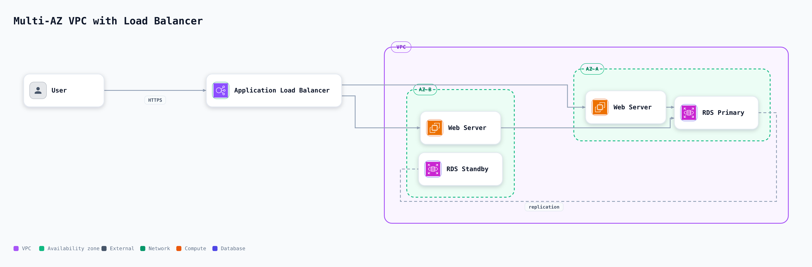
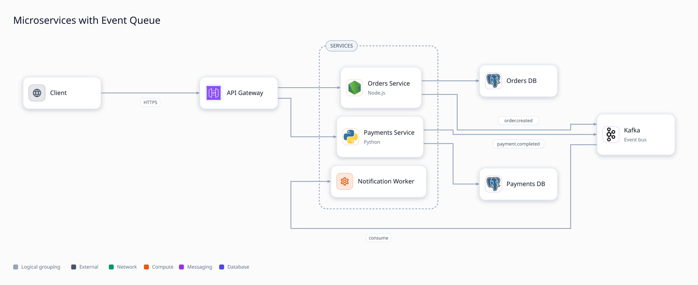
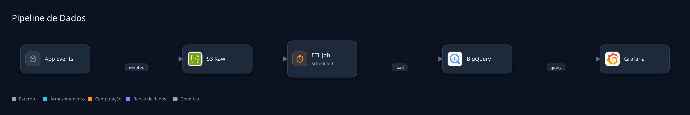
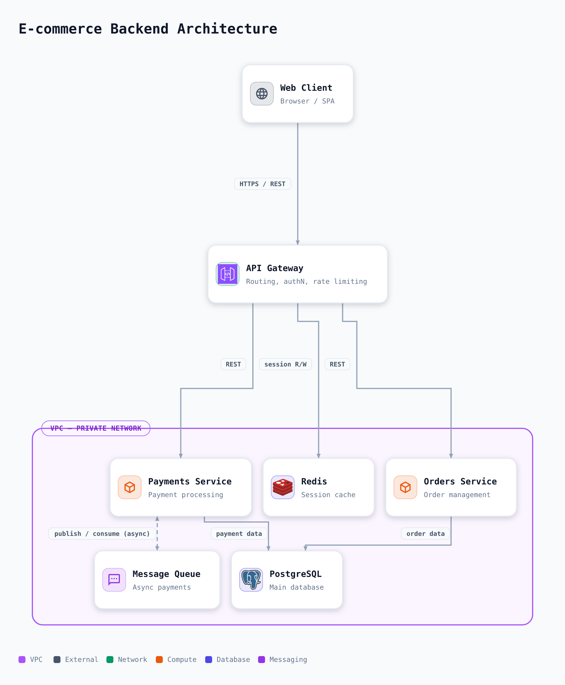
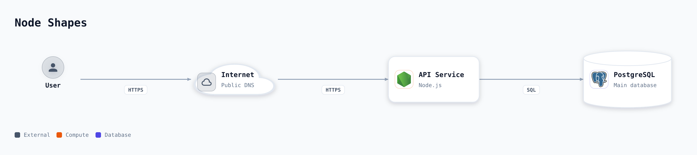

# architecture-diagrams

[](https://github.com/nolram/architecture-diagrams/releases/latest) [](https://github.com/nolram/architecture-diagrams/actions/workflows/ci.yml) [](LICENSE)

Generates **visually rich, professional** software/infrastructure architecture diagrams from a structured YAML spec -- built to be used by an AI (e.g. as a Claude Skill), not hand-drawn.

The motivation: diagrams generated by AI today usually come out as Mermaid -- functional, but visually poor (plain boxes, no icons, no visual hierarchy). This project swaps Mermaid's syntax for a structured spec and its own rendering engine, with real brand icons (195 curated entries covering AWS/Azure/GCP/Kubernetes/technologies, searchable via `arch-diagram icons <term>`), 4 node shapes (card, cylinder for databases, actor, cloud), nested boundaries (VPC/subnet/AZ), an automatic color legend, and fully automatic layout -- including the diagram's own orientation (`direction: auto`).

## Diagram families

Two diagram families share the same validation → layout → render pipeline, selected by the spec's `type` field:

- **Architecture diagrams** (default -- omit `type` or set `type: architecture`): components, boundaries, and connections with real brand icons.
- **UML class diagrams** (`type: uml-class`): classes with attributes/methods and the six UML relationship kinds (association, aggregation, composition, inheritance, dependency, realization). Format: [`architecture-diagrams/reference/uml-class-spec.md`](architecture-diagrams/reference/uml-class-spec.md); runnable example: [`architecture-diagrams/reference/uml-class.example.yaml`](architecture-diagrams/reference/uml-class.example.yaml).

## Examples

| 3-tier web | Multi-AZ VPC |
|---|---|
|  |  |

| Microservices with a queue | Data pipeline (dark theme) |
|---|---|
|  |  |

| Fan-out backend (`direction: auto` picking `down` on its own) | The 4 node shapes (actor, cloud, card, database) |
|---|---|
|  |  |

Full specs for these examples live in [`examples/`](examples/) and [`architecture-diagrams/reference/patterns.md`](architecture-diagrams/reference/patterns.md).

## How it works

```text
YAML/JSON spec
  → validation (zod, actionable errors with the exact field path)
  → automatic hierarchical layout (ELK.js -- right/down direction auto-detected from
    the graph's fan-out/fan-in, groups become nested containers, edges routed through
    the lowest common ancestor container of source and target, edge labels get reserved space)
  → SVG composition (4 node shapes -- card/database/actor/cloud --, shadow/gradient/
    rounded corners, icons resolved via `thesvg` + `@iconify-json/mdi`, groups
    rendered as labeled boundaries, automatic color legend when there's enough variety)
  → export to SVG (default) + PNG + PDF
```

Stack: Node.js + TypeScript. No dependency on Mermaid, D2, or Graphviz -- the layout engine (ELK.js) and SVG composition are done directly, which gives full control over the visual result.

## Dependencies

| Package | License | Purpose |
|---|---|---|
| [elkjs](https://github.com/kieler/elkjs) | EPL-2.0 OR GPL-3.0-or-later | Hierarchical automatic graph layout |
| [thesvg](https://thesvg.org) | MIT | Offline AWS/Azure/GCP/brand icon set |
| [@iconify-json/mdi](https://github.com/iconify/icon-sets) | Apache-2.0 | Generic icon shapes (Material Design Icons) |
| [zod](https://zod.dev) | MIT | Spec schema validation |
| [yaml](https://eemeli.org/yaml/) | ISC | YAML parsing |
| [commander](https://github.com/tj/commander.js) | MIT | CLI argument parsing |
| [@resvg/resvg-js](https://github.com/thx/resvg-js) | MPL-2.0 | SVG rasterization to PNG |
| [pdfkit](https://pdfkit.org) | MIT | PDF generation |
| [typescript](https://www.typescriptlang.org) | Apache-2.0 | Language / build |
| [tsx](https://github.com/privatenumber/tsx) | MIT | TypeScript dev runner |

All dependencies are consumed as unmodified npm packages (not vendored or forked), so this project's own [MIT license](LICENSE) applies regardless of each dependency's own license.

## Installation

```bash
npm install
npm run build
```

## Testing

```bash
npm test           # test suite (node:test, run via tsx -- covers spec/layout/icons/render)
npm run typecheck  # type-checks src/ and tests/
npm run validate:icons  # confirms every catalog icon still resolves against the installed packages
```

CI runs all of this (plus a smoke test rendering `examples/`) on every push.

## Usage

```bash
node dist/cli.js diagram.yaml --png -o diagram.svg
# generates diagram.svg and diagram.png (equivalent to `node dist/cli.js render diagram.yaml ...`)

node dist/cli.js diagram.yaml --pdf
# also generates a single-page PDF sized exactly to the diagram

node dist/cli.js diagram.yaml --watch
# re-renders automatically every time the spec file is saved

node dist/cli.js icons postgres
# searches the icon catalog by key, label, or category
```

Or in dev mode (no build needed first):

```bash
npx tsx src/cli.ts diagram.yaml --png -o diagram.svg
```

### Example spec

```yaml
version: '1'
title: 3-Tier Web Architecture
theme: clean-light
nodes:
  - id: user
    label: User
    icon: generic:user
    category: external
  - id: web
    label: Web Server
    sublabel: Node.js / Express
    icon: aws:lambda
    category: compute
    group: vpc
  - id: db
    label: PostgreSQL
    icon: aws:rds
    category: database
    group: vpc
groups:
  - id: vpc
    label: VPC
    style: vpc
edges:
  - from: user
    to: web
    label: HTTPS
  - from: web
    to: db
    label: SQL
```

Full spec guide, available icon catalog, and more ready-made patterns in [`architecture-diagrams/reference/`](architecture-diagrams/reference/).

## Using it as a Claude Skill

The [`architecture-diagrams/`](architecture-diagrams/) directory is a self-contained [Claude Skill](https://www.anthropic.com/news/skills): `SKILL.md` + reference guides + a render script, so an AI can read the docs, write the spec, and generate the diagram on its own.

Download the already-packaged `.skill` from the [releases page](https://github.com/nolram/architecture-diagrams/releases/latest) -- every release is generated automatically by the pipeline (`.github/workflows/release.yml`) from the source code, so the artifact never drifts out of sync with the skill's content. To package a local version manually:

```bash
npm run package:skill
```

## Project structure

```text
src/
  spec/     schema (zod) + YAML/JSON spec parser
  icons/    curated catalog (195 icons) + resolver (thesvg / mdi) with fallback + search
  layout/   ELK.js integration (hierarchical graph → absolute positions) + automatic direction
  render/   design tokens (themes) + SVG composition (node shapes, groups, edges, legend)
  export/   PNG rasterization + PDF generation
  cli.ts    CLI (`arch-diagram`: render + icons)
examples/                    already-rendered example specs
architecture-diagrams/       the Claude Skill (SKILL.md + reference/ + scripts/)
```

## License

[MIT](LICENSE) -- see [Dependencies](#dependencies) above for third-party license notices.
