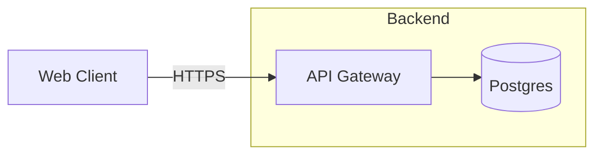

# Mermaid import (flowchart → architecture spec)

The adoption story: most teams already have Mermaid diagrams. They are functional but visually poor (plain boxes, no icons, no visual hierarchy). Instead of redrawing them by hand, **import them**: the tool parses a Mermaid `flowchart`/`graph` and converts it into a valid **architecture spec** that the existing pipeline renders -- same icons, boundaries, and automatic layout as a spec you would have written from scratch.

The conversion is **deterministic and mechanical** (parse shapes, edges, subgraphs, direction; map them onto the spec). It does **not** add anything Mermaid doesn't state: no icons, no categories beyond shape inference, no semantic edge labels. That is the LLM's (or your) job after import -- the same boundary as `detect`: the tool emits a draft, the LLM refines it, then renders.

## Commands

```bash
# CLI
arch-diagram import diagram.mmd                 # converted architecture spec (YAML) to stdout
arch-diagram import diagram.mmd --render        # also render the converted spec to SVG (imported.svg)
arch-diagram import diagram.mmd --render -o out.svg

# MCP (the same capability as a tool)
import_mermaid({ mermaid: "flowchart LR\n  A --> B" })   # -> { spec, warnings } (JSON)
import_mermaid({ path: "diagram.mmd" })                  # same, from a .mmd file
```

Warnings (dropped styling, non-square shapes) print to stderr and never fail the import. The MCP flow is: `import_mermaid` → review/refine the `spec` (add icons, categories, fix edges) → `render_diagram`.

## Supported syntax

Mermaid `flowchart` / `graph` headers (with or without a direction), node declarations in every shape notation, all arrow types (incl. thick `==>`/`==`), both label styles, chained edges, subgraphs (including nested ones), `direction` statements, and `%%` comments:



converts to (this is the exact output of `arch-diagram import`):

```yaml
type: architecture
version: '1'
title: Imported from Mermaid
theme: clean-light
direction: right          # LR -> right; TD/BT -> down; none -> auto
nodes:
  - id: client
    label: Web Client
    category: generic     # non-cylinder shapes get category "generic"
    shape: card           # square node -> card (no warning for plain squares)
  - id: api
    label: API Gateway
    category: generic
    shape: card
    group: sg1            # node declared inside the subgraph
  - id: db
    label: Postgres
    category: database    # cylinder -> database shape + category
    shape: database
    group: sg1
groups:
  - id: sg1               # subgraph id is generated (sg1, sg2, ...); the title becomes the label
    label: Backend
    style: boundary       # subgraphs always render as boundary groups
edges:
  - from: client
    to: api
    style: solid
    direction: forward
    label: HTTPS          # |label| and dash-embedded labels are preserved
  - from: api
    to: db
    style: solid
    direction: forward
```

The result always satisfies the architecture spec schema, so it passes validation unchanged and renders through the existing pipeline.

## Mapping table

| Mermaid | → architecture spec | Notes |
|---|---|---|
| `A[(text)]` (cylinder) | `shape: database`, `category: database` | the only shape that maps to a non-card |
| `A[text]` (square) | `shape: card`, `category: generic` | no warning -- the default shape |
| `A(text)` / `A((text))` / `A(((text)))` / `A>text]` / `A{text}` / `A{{text}}` / `A[[text]]` / `A[/text/]` (rounded, circle, stadium, asymmetric, diamond, hexagon, subroutine, parallelogram) | `shape: card`, `category: generic` | **warning** naming the shape, e.g. `Node "decide" uses the Mermaid "diamond" shape, which is rendered as a plain card.` |
| `A --> B` | edge `style: solid`, `direction: forward` | |
| `A -.-> B` | edge `style: dashed`, `direction: forward` | |
| `A <--> B` | edge `direction: bidirectional` | |
| `A --- B` | edge `direction: none` (undirected) | |
| `A ==> B` / `A == B` (thick arrow / line) | same as `-->` / `---` (thickness is dropped) | the spec has no "thick" style, so it maps to the plain equivalent |
| `A <-- B` (left-pointing) | flow reversed: edge from `B` to `A` | the arrowhead decides direction, not the node order |
| `A -->\|label\| B` and `A -- label --> B` (incl. dashed `-. label .->`) | edge `label` | both label styles are preserved |
| `A --> B --> C` (chained) | two edges: A→B, B→C | |
| duplicate edges / self-edges (`A --> A`) | deduplicated / dropped | self-edges are not meaningful in the spec |
| `subgraph Title` ... `end` | a group with `style: boundary`; label = the subgraph title (or the `id [title]` form's title) | group ids are generated (`sg1`, `sg2`, ...) in declaration order |
| nested subgraphs | inner group gets `parent: <outer group id>` | nodes map to their **innermost** enclosing subgraph |
| header `flowchart TD` / `BT` (also `TB`) or a `direction TD`/`BT` statement | `direction: down` | a later `direction` statement overrides the header |
| header `flowchart LR` / `RL` or a `direction LR`/`RL` statement | `direction: right` | |
| no direction anywhere | `direction: auto` | the layout engine picks from the graph's fan-out/fan-in |
| node ids with invalid characters (e.g. quoted `"my node"`) | sanitized to `[a-zA-Z0-9_-]` (others → `_`), collisions suffixed `_2`, `_3`, ... | edges are remapped to the sanitized ids |

## What is dropped (warnings, never failures)

Statements that are recognized but have no spec equivalent are **dropped with a warning** (`Dropped unsupported statement (not importable): <line>`), and the import still succeeds:

| Dropped statement | Why |
|---|---|
| `classDef red fill:#f00` | no class definitions in the spec -- styling is per-node via `icon`/`category` |
| `style A fill:#f9f` | per-node styling is not part of the spec |
| `linkStyle 0 stroke:#f00` | per-edge styling is not part of the spec |
| `click A url(...)` | click handlers have no rendering equivalent |
| `class A red` (class application) | applies a dropped `classDef` -- nothing to apply |

## Limitations / not supported

- **Other Mermaid diagram types** (`sequenceDiagram`, `classDiagram`, `erDiagram`, ...) -- a hard error: `Unsupported Mermaid diagram type "sequenceDiagram". Only "flowchart" / "graph" is supported.`
- **Unclosed `subgraph`** or a stray `end` -- hard errors (the diagram is structurally broken, so there is nothing safe to import).
- **Styling** -- see above; colors, fonts, and link styles are dropped.
- **Icons** -- imported nodes have **no icon by default**. The converter cannot know that a node labeled "Postgres" should get `brand:postgresql`; that is exactly the refinement step. Search the catalog (`arch-diagram icons postgres`) and add `icon` + `category` after import.
- **Actor / cloud shapes** -- Mermaid flowcharts have no notion of them; if a node is really an actor or external system, change its `shape`/`category` after import.
- **Subgraph styling** -- subgraphs always become `boundary` groups; Mermaid subgraph colors are dropped.

## Workflow

1. **Import** -- `arch-diagram import diagram.mmd` (or the `import_mermaid` MCP tool). Read the warnings: they tell you what was dropped and which shapes became plain cards.
2. **Review and refine** -- this is where the LLM (or you) stays in the loop:
   - add `icon` + `category` to nodes (search the catalog; don't invent keys);
   - fix or relabel edges the mechanical mapping got wrong (e.g. a `---` that was really a call);
   - rename generated group ids/labels if they are ugly, and add sublabels;
   - adjust `direction` if `auto`/`down`/`right` doesn't suit the diagram.
3. **Render** -- `arch-diagram render refined.yaml --png -o diagram.svg`, or `render_diagram` with the refined spec.

The import is a deterministic draft, not a finished diagram -- the same "mechanical part deterministic, semantic part LLM" split as `detect` and `check`.
